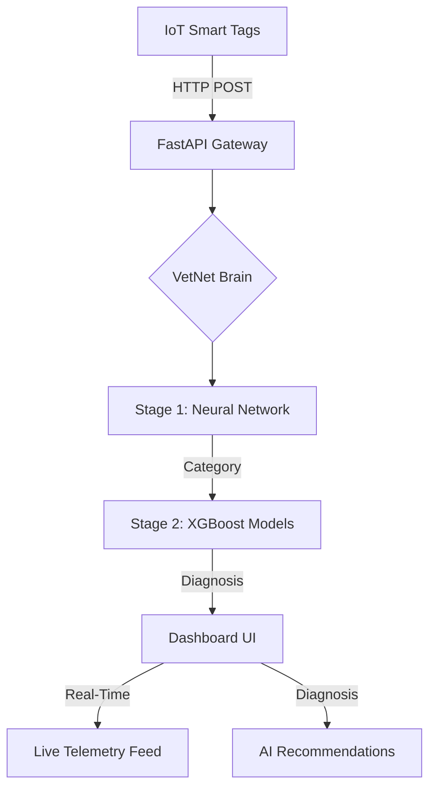

# VetNet AI - Enterprise Veterinary Disease Prediction Platform


## 🚀 Overview

VetNet AI is a cutting-edge veterinary diagnostic platform that combines **Deep Learning (PyTorch)** with **XGBoost** to provide real-time disease prediction across 24 animal species. The system integrates with IoT smart tags for continuous health monitoring and AI-powered diagnostics, offering a "God Tier" dashboard for veterinary professionals.

### Key Features
- **🧠 Hybrid AI Engine**: VetNet Neural Network (Stage 1) for category detection + XGBoost (Stage 2) for specific disease prediction.
- **📡 IoT Real-Time Integration**: Seamless telemetry ingestion from smart collars/ear tags (Temperature, Heart Rate, Activity).
- **🌍 Massive Species Support**: 24 species including Zoo, Farm, and Exotic animals (Dogs, Cats, Cattle, Lions, Elephants, etc.).
- **🎯 Clinical-Grade Accuracy**: 95.47% category accuracy validated on 15,000+ clinical signatures.
- **🎨 Premium UI/UX**: Glassmorphism dashboard with species-specific icons, real-time sync indicators, and dark mode.
- **� Advanced Analytics**: Geospatial mapping of disease outbreaks, temporal trends, and system health monitoring.

---

## 📊 Supported Species (24 Total)

| Category | Species |
| :--- | :--- |
| **Pets & Exotic** | Dog, Cat, Rabbit, Parrot, Lizard, Snake, Turtle, Fish, Guinea Pig, Ferret |
| **Farm & Livestock** | Cattle, Buffalo, Sheep, Goat, Pig, Horse, Chicken, Turkey, Duck, Llama, Alpaca |
| **Zoo Animals** | Lion, Tiger, Elephant |

---

## 🏗️ System Architecture



---

## 🛠️ Installation & Setup

### Prerequisites
- Python 3.10+
- Node.js 18+
- Docker & Docker Compose (for containerized deployment)

### 1. Local Development Setup
```bash
# Clone the repository
git clone https://github.com/YOUR_USERNAME/vetnet-ai.git
cd vetnet-ai

# Install Backend dependencies
pip install -r requirements.txt

# Start the Backend (FastAPI)
# This also starts the IoT Simulator in the background
python simple_api.py

# Install Frontend dependencies
cd vetnet-ui
npm install

# Start the Frontend (Vite)
npm run dev
```

### 2. Docker Deployment
```bash
# Build and run all services
docker-compose up --build

# Access the UI at http://localhost:5173
# Access the API at http://localhost:8002
```

### 3. Vercel + Docker Deployment (Production)

Since VetNet AI uses heavy ML models, we use a hybrid approach:
*   **Frontend**: Deploy to **Vercel** (Root: `vetnet-ui`, Framework: `Vite`).
*   **Backend**: Deploy via **Docker** to a container host (Render, Railway, or AWS).

#### Steps:
1.  Push the project to GitHub.
2.  Deploy the Backend to **Render** (or similar) using the `Dockerfile` in `animal_fresh/`.
3.  Deploy the Frontend to **Vercel**, adding `VITE_API_URL` (pointing to your Backend) as an environment variable.

---

## 📦 Deployment & DevOps

### Environment Variables (.env)
Create a `.env` in the root for production configuration:
```env
API_PORT=8002
API_HOST=0.0.0.0
ALLOWED_ORIGINS=http://localhost:5173,https://your-domain.com
SECRET_KEY=your-production-secret
```

### � CI/CD Setup (GitHub Actions)
Add the following secrets to your GitHub repository (Settings → Secrets → Actions):
1. `DOCKER_USERNAME`: Your Docker Hub username.
2. `DOCKER_PASSWORD`: Your Docker Hub access token.

**The pipeline automatically:**
- Validates Python code and AI models.
- Builds the React frontend.
- Creates and pushes Docker images to Docker Hub.

---

## 📡 IoT & Hardware Integration

### Hardware Requirements
- **Microcontroller**: ESP32-WROOM-32
- **Sensors**: DS18B20 (Temp), MAX30102 (Pulse), ADXL345 (Accelerometer)

### Firmware Installation
1. Open `hardware/VetNet_SmartTag_ESP32.ino` in Arduino IDE.
2. Update WiFi credentials and your Server IP.
3. Upload to the ESP32 device.

### Ingesting Telemetry (API Sample)
```bash
POST /iot/telemetry
{
  "device_id": "TAG_001",
  "animal_id": "Simba",
  "species": "Lion",
  "temperature": 39.2,
  "heart_rate": 62,
  "activity_level": 45.0
}
```

---

## � Model Performance

| Model | Accuracy | Feature Set |
| :--- | :--- | :--- |
| **VetNet Neural Network** | 95.47% | 25 Clinical Features (Vitals + Bloodwork) |
| **XGBoost Stage 2** | 94.30% | Disease-specific classification |

### Clinical Data Points Used:
- **Vitals**: Temp, Heart Rate, Activity Index.
- **Blood Work**: WBC, RBC, Hemoglobin, Platelets, Glucose, ALT, AST, Urea, Creatinine.
- **Symptoms**: Fever, Lethargy, Vomiting, Diarrhea, Coughing, Lameness, Skin Lesions.

---

## 📁 Project Structure

```
vetnet-ai/
├── src/
│   ├── models/             # PyTorch Neural Network definitions
│   ├── inference_nn.py      # Core AI prediction engine
│   ├── train_nn.py          # NN training scripts
│   ├── iot_gateway.py       # IoT telemetry & device handling
│   └── monitoring.py        # System health & metric logging
├── scripts/                # Utility scripts (Simulator, Retraining)
├── vetnet-ui/               # React + Tailwind Dashboard
├── hardware/               # ESP32 Firmware (C++)
├── models/                  # Saved .PTH and .PKL model files
├── data/                    # Clinical datasets for training
├── logs/                    # Automated prediction & health logs
├── simple_api.py            # Main FastAPI Server
├── Dockerfile               # Container manifest
└── docker-compose.yml       # Orchestration manifest
```

---

## 🐛 Troubleshooting & Support

- **Port 8002 Conflict**: If the API fails to start, check for processes using `netstat -ano | findstr :8002` and kill them.
- **Model Load Error**: Ensure you have run the training scripts `python src/train_nn.py` if the `models/` folder is empty.
- **Dashboard Data Lag**: The dashboard polls every 1s. Ensure the `simple_api.py` is running to see live data.

---

## � License & Acknowledgments

- **License**: MIT
- **Built With**: PyTorch, FastAPI, XGBoost, React, Tailwind CSS, Lucide Icons.

---
**Built with ❤️ for veterinary professionals worldwide**
