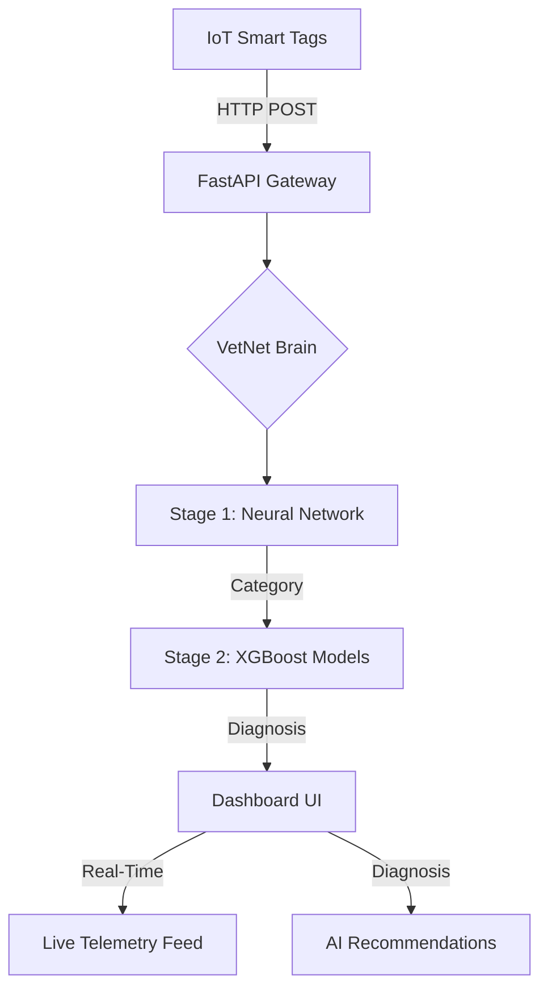

# VetNet AI - Enterprise Veterinary Disease Prediction Platform


## 🚀 Overview

VetNet AI is a cutting-edge veterinary diagnostic platform that combines **Deep Learning (PyTorch)** with **XGBoost** to provide real-time disease prediction across 24 animal species. The system integrates with IoT smart tags for continuous health monitoring and AI-powered diagnostics, offering a "God Tier" dashboard for veterinary professionals.

**Production URL**: [https://vetnet-pred.vercel.app/](https://vetnet-pred.vercel.app/)

### Key Features
- **🧠 Hybrid AI Engine**: VetNet Neural Network (Stage 1) for category detection + XGBoost (Stage 2) for specific disease prediction.
- **📡 IoT Real-Time Integration**: Seamless telemetry ingestion from smart collars/ear tags (Temperature, Heart Rate, Activity).
- **🌍 Massive Species Support**: 24 species including Zoo, Farm, and Exotic animals (Dogs, Cats, Cattle, Lions, Elephants, etc.).
- **🎯 Clinical-Grade Accuracy**: 95.47% category accuracy validated on 15,000+ clinical signatures.
- **🎨 Premium UI/UX**: Glassmorphism dashboard with species-specific icons, real-time sync indicators, and dark mode.
- **📈 Advanced Analytics**: Geospatial mapping of disease outbreaks, temporal trends, and system health monitoring.

---

## 📊 Supported Species (24 Total)

| Category | Species |
| :--- | :--- |
| **Pets & Exotic** | Dog, Cat, Rabbit, Parrot, Lizard, Snake, Turtle, Fish, Guinea Pig, Ferret |
| **Farm & Livestock** | Cattle, Buffalo, Sheep, Goat, Pig, Horse, Chicken, Turkey, Duck, Llama, Alpaca |
| **Zoo Animals** | Lion, Tiger, Elephant |

---

## 🏗️ System Architecture



---

## 🛠️ Installation & Setup

### Prerequisites
- Python 3.10+
- Node.js 18+
- Docker & Docker Compose (for containerized deployment)

### 1. Local Development Setup
```bash
# Clone the repository
git clone https://github.com/YOUR_USERNAME/vetnet-ai.git
cd vetnet-ai

# Install Backend dependencies
pip install -r requirements.txt

# Start the Backend (FastAPI)
python simple_api.py

# Install Frontend dependencies
cd vetnet-ui
npm install

# Start the Frontend (Vite)
npm run dev
```

### 2. Docker Deployment (Local)
```bash
# Build and run all services
docker-compose up --build

# Access the UI at http://localhost:5173
# Access the API at http://localhost:8002
```

### 3. Vercel + Docker Deployment (Production)
We use a hybrid approach for optimal performance:
*   **Frontend**: Hosted on **Vercel** (Root: `vetnet-ui`, Framework: `Vite`).
*   **Backend**: Hosted via **Docker** on Render (Standard 2GB RAM).

**Steps**:
1. Deploy Backend to Render using the `Dockerfile` (ensure `PORT` env is set).
2. Set `VITE_API_URL` as an environment variable in Vercel to point to Render.

---

## ⚠️ Challenges & Lessons Learned

Developing a production-grade AI platform involved solving several key technical hurdles:

### 1. **Dockerized ML Model Inclusion** 🧠
*   **Challenge**: AI models (`.pth` and `.pkl`) were ignored by Git/Docker due to size, causing production failures.
*   **Solution**: Updated ignore rules and force-tracked essential weights while ensuring the Docker build context included the `models/` folder.

### 2. **Dependency & Enviroment Synchronization** 📦
*   **Challenge**: Render builds failed due to missing `pypdf` and `python-multipart` libraries not present in standard images.
*   **Solution**: Modernized the `Dockerfile` and migrated FastAPI to use the newer `lifespan` manager, resolving deprecated event warnings.

### 3. **Dynamic Port Binding** 🔌
*   **Challenge**: Hardcoded ports caused deployment loops on Render.
*   **Solution**: Integrated dynamic port binding: `port = int(os.environ.get("PORT", 8002))`.

### 4. **Real-Time Data Latency** �
*   **Challenge**: Initial polling felt "laggy" for emergency monitoring.
*   **Solution**: Optimized Vite builds and reduced frontend polling intervals to 1s with Framer Motion animations for a "live uplink" sensation.

---

## 🔬 Model Performance

| Model | Accuracy | Feature Set |
| :--- | :--- | :--- |
| **VetNet Neural Network** | 95.47% | 25 Clinical Features (Vitals + Bloodwork) |
| **XGBoost Stage 2** | 94.30% | Disease-specific classification |

**Data Points**: WBC, RBC, Hemoglobin, Platelets, Glucose, ALT, AST, Urea, Creatinine, Fever, Lethargy, Vomiting, Diarrhea, Coughing, Lameness, Skin Lesions.

---

## 📡 IoT & Hardware Integration

### Hardware Requirements
- **Microcontroller**: ESP32-WROOM-32
- **Sensors**: DS18B20 (Temp), MAX30102 (Pulse), ADXL345 (Accelerometer)

### Firmware Installation
1. Open `hardware/VetNet_SmartTag_ESP32.ino` in Arduino IDE.
2. Update WiFi credentials and your Server IP.
3. Upload to the ESP32 device.

---

## 📁 Project Structure

```
vetnet-ai/
├── src/
│   ├── models/             # PyTorch definitions
│   ├── inference_nn.py      # AI prediction engine
│   ├── iot_gateway.py       # Telemetry handling
│   └── monitoring.py        # System health logging
├── vetnet-ui/               # React Dashboard (Vercel)
├── models/                  # AI Model Weights
├── data/                    # Training datasets
├── simple_api.py            # Main API Server
└── Dockerfile               # Container manifest
```

---

## 🐛 Troubleshooting

- **Model Load Error**: Ensure `models/` directory contains all `.pkl` and `.pth` files.
- **Port Conflict**: Kill existing processes or update the `PORT` environment variable.
- **CORS Errors**: Check `ALLOW_ORIGINS` in `simple_api.py` if using a custom domain.

---

## 📝 License & Acknowledgments
- **License**: MIT
- **Built With**: PyTorch, FastAPI, XGBoost, React, Tailwind CSS, Lucide Icons.

**Built with ❤️ for veterinary professionals worldwide**
